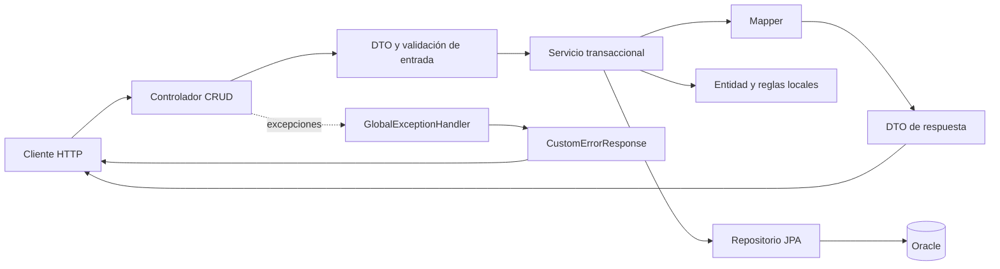
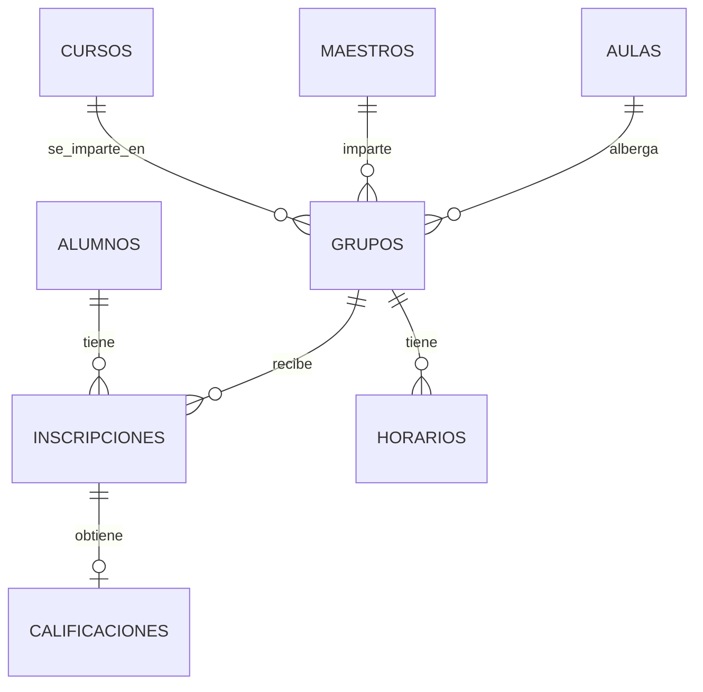

# Análisis y recopilatorio del proyecto Escuela

Fecha de revisión: 8 de septiembre de 2026. Rama revisada: `develop`. Referencia inicial: `ba7b2bd`. El árbol de trabajo estaba limpio al comenzar.

Este documento explica el código actual carpeta por carpeta, capa por capa y método por método. Distingue comportamiento visible en el código, comprobaciones realizadas y aspectos pendientes de probar. No modifica la implementación.

**Corte de revisión:** el recorrido y la compilación corresponden a las 41 fuentes principales presentes al inicio. Durante la redacción aparecieron modificaciones externas a esta revisión; se describen en el apartado 16 para conservar la trazabilidad sin atribuirlas al análisis.

## 1. Qué tenemos construido

Tenemos un backend de gestión escolar en Java con Spring Boot, persistencia JPA sobre Oracle, DTO para intercambiar datos, mappers manuales, servicios transaccionales y manejo centralizado de excepciones.

Hay **41 archivos Java de aplicación**, con **1,323 líneas**, y **un archivo Java de prueba**. El dominio contiene ocho entidades. Alumnos y maestros tienen controladores y servicios; cursos tiene entidad, DTO y mapper, y participa en las respuestas de maestros y alumnos. Las otras entidades representan relaciones escolares, pero no tienen operaciones propias expuestas por HTTP.

| Módulo | Entidad | DTO | Mapper | Repositorio | Servicio | Controlador |
| --- | --- | --- | --- | --- | --- | --- |
| Alumnos | Sí | Request y Response | Sí | Sí | Sí, con fallos identificados | Sí |
| Maestros | Sí | Request y Response | Sí | Sí | Sí | Sí |
| Cursos | Sí | Request y Response | Sí | No | No | No |
| Grupos | Sí | Carpeta vacía | No | Sí, usado para comprobar relaciones | No | No |
| Inscripciones | Sí | Carpeta vacía | No | Sí, usado para comprobar relaciones | No | No |
| Aulas | Sí | Carpeta vacía | No | No | No | No |
| Horarios | Sí | Carpeta vacía | No | No | No | No |
| Calificaciones | Sí | Carpeta vacía; existe resumen compartido | No | No | No | No |

La presencia de una entidad no significa que su módulo esté terminado. El CRUD de alumnos está declarado, pero su eliminación no ejecuta el borrado. No se comprobó el funcionamiento integral de ninguno de los módulos contra Oracle.

## 2. Recorrido por carpetas y archivos de infraestructura

```text
escuela/
├── pom.xml
├── mvnw / mvnw.cmd
├── .mvn/wrapper/maven-wrapper.properties
├── .gitignore / .gitattributes
├── src/main/java/com/example/escuela/
│   ├── EscuelaApplication.java
│   ├── controllers/       # HTTP y contrato CRUD reutilizable
│   ├── services/          # Contrato común
│   │   ├── alumnos/      # Interfaz e implementación
│   │   └── maestros/     # Interfaz e implementación
│   ├── repositories/     # Acceso a Oracle mediante JPA
│   ├── entities/         # Ocho entidades persistentes
│   ├── dto/
│   │   ├── alumno/       # Entrada y salida de alumnos
│   │   ├── maestro/      # Entrada y salida de maestros
│   │   ├── curso/        # Entrada y salida de cursos
│   │   ├── datos/        # Resúmenes de cursos y calificaciones
│   │   └── aula/, calificacion/, grupo/, horario/, inscripcion/ # Vacías
│   ├── mappers/          # Conversión DTO ↔ entidad
│   ├── exceptions/       # Excepciones propias y traducción HTTP
│   ├── enums/            # Días de la semana
│   └── utils/            # Validaciones, fechas y búsquedas comunes
├── src/main/resources/
│   ├── application.properties
│   ├── static/           # Vacía
│   └── templates/        # Vacía
└── src/test/java/com/example/escuela/EscuelaApplicationTests.java
```

También existen `.git/`, `.idea/`, `.env`, `HELP.md` y `target/` localmente. Git no versiona carpetas vacías, por lo que algunas carpetas del árbol no aparecerán en un clon nuevo.

### `pom.xml`: construcción y dependencias

Identifica el proyecto como `com.example:escuela:0.0.1-SNAPSHOT`, con Spring Boot **4.1.1**, Java objetivo **17** y Kotlin **2.3.20**. Estos valores se leyeron del repositorio; no expresan una recomendación de versiones.

| Dependencia o configuración | Papel actual |
| --- | --- |
| `spring-boot-starter-data-jpa` | Integra repositorios, entidades y persistencia JPA. |
| `spring-boot-starter-validation` | Aporta validación de DTO y parámetros. |
| `spring-boot-starter-webmvc` | Permite declarar controladores HTTP. |
| `springdoc-openapi-starter-webmvc-ui:3.1.0` | Integra documentación OpenAPI y su interfaz; hay anotaciones `@Schema` y `@Tag`. |
| `ojdbc17`, alcance runtime | Controlador JDBC de Oracle. |
| Lombok, opcional | Genera constructores, getters, builders y logger durante la compilación. |
| Starters de pruebas JPA, validation y webmvc | Dependencias disponibles para pruebas, aunque actualmente solo existe una prueba de contexto. |
| `kotlin-stdlib` y `kotlin-test` | Soporte Kotlin; no hay fuentes Kotlin en este proyecto. |
| `spring-boot-maven-plugin` | Herramientas de construcción y ejecución de Spring Boot. |
| `kotlin-maven-plugin` y complemento Lombok | Configuración de compilación mixta; `jvmTarget` está en `1.8`. |
| `maven-compiler-plugin` | Compilación Java y procesamiento de anotaciones Lombok. |

Hay ejecuciones Java tanto con identificadores `default-compile`/`default-testCompile` como `compile`/`testCompile`. La compilación realizada mostró que se compilan dos veces los 41 archivos principales. También se ejecutan fases Kotlin sin fuentes. Es una simplificación pendiente, no un impedimento de compilación observado. La diferencia entre Java 17 y destino Kotlin 1.8 conviene resolver si se incorpora Kotlin.

Los campos de nombre, descripción, URL, licencias, desarrolladores y SCM están vacíos. Falta documentación específica del proyecto en la raíz.

### Maven Wrapper

`.mvn/wrapper/maven-wrapper.properties` fija Wrapper **3.3.4**, distribución `only-script` y Maven **3.9.16**. Esto permite ejecutar `./mvnw` sin instalar un comando `mvn` global.

`mvnw` es un script de infraestructura. Sus funciones son:

| Función | Responsabilidad |
| --- | --- |
| `native_path()` | Devuelve una ruta; en Cygwin/Mingw convierte al formato requerido por Windows. |
| `set_java_home()` | Localiza `java` y `javac`, considerando `JAVA_HOME`, y comprueba que sean ejecutables. |
| `hash_string()` | Calcula un hash de la URL para identificar la carpeta de caché de Maven. |
| `verbose()` | No hace nada normalmente; imprime información cuando se solicita modo verbose. |
| `die()` | Muestra un error y termina con código no exitoso. |
| `trim()` | Elimina espacios en blanco al leer propiedades del Wrapper. |
| `exec_maven()` | Limpia variables del Wrapper y sustituye el proceso por Maven, conservando los argumentos. |
| `clean()` | Elimina la carpeta temporal creada durante la descarga de la distribución. |
| `Downloader.getPasswordAuthentication()` | En la alternativa de descarga mediante Java, obtiene credenciales de variables de entorno. |
| `Downloader.main()` | En esa alternativa, descarga la distribución a la ruta temporal indicada. |

El flujo general lee la URL, reutiliza la caché si existe o descarga mediante wget, curl o Java, verifica SHA-256 si se configuró, descomprime y ejecuta Maven. No hay `distributionSha256Sum` configurado en el archivo actual.

`mvnw.cmd` cumple el mismo propósito en Windows mediante batch y PowerShell: lee propiedades, identifica plataforma y caché, descarga y extrae Maven cuando hace falta, devuelve su comando y lo ejecuta con los argumentos originales. Incluye tratamiento de errores y limpieza temporal; no contiene lógica escolar. No se ejecutó en Windows.

### Configuración de ejecución

En `src/main/resources/application.properties`:

| Propiedad | Significado |
| --- | --- |
| `spring.application.name=almacen` | Nombre de la aplicación; no coincide con Escuela. |
| `server.port=${PORT}` | El puerto depende de una propiedad o variable externa. |
| `spring.datasource.url=${DB_URL}` | Dirección JDBC de Oracle. |
| `spring.datasource.username=${DB_USER}` | Usuario de conexión. |
| `spring.datasource.password=${DB_PASS}` | Contraseña de conexión. |
| `spring.datasource.driver-class-name=oracle.jdbc.OracleDriver` | Selección explícita del controlador Oracle. |
| `spring.jpa.hibernate.ddl-auto=validate` | Se pretende validar el esquema existente, no crearlo con esta configuración. |

Existe `.env` ignorado por Git. No se reprodujeron sus valores. No hay una importación de `.env` en la configuración mostrada ni una dependencia dotenv declarada: su mera presencia no demuestra que los valores estén disponibles al proceso. El IDE o el entorno de lanzamiento pueden proporcionarlos, pero eso no está documentado en el repositorio.

No se encontraron scripts SQL, migraciones Flyway/Liquibase, Dockerfile, configuración Compose ni flujos CI versionados. Para reproducir el entorno faltan especialmente las definiciones del esquema y las funciones Oracle utilizadas por alumnos.

### Archivos y carpetas auxiliares

- `.gitignore`: excluye compilados, `.env`, `HELP.md` y configuraciones de varios IDE.
- `.gitattributes`: fija finales de línea LF para `mvnw` y CRLF para archivos `.cmd`.
- `HELP.md`: ayuda generada con enlaces de Spring/Maven; no explica reglas escolares ni instalación de Oracle.
- `.git/`: historial, referencias y metadatos de control de versiones; se consultaron estado, rama e historial, no se auditaron sus objetos internos como código de aplicación.
- `.idea/`: configuración local de IntelliJ, excluida del control de versiones; no define la lógica del backend.
- `target/`: resultados de compilación regenerables; se usaron para verificar la construcción, no como fuente del análisis.
- `static/` y `templates/`: vacías; no hay una interfaz web desarrollada en ellas.

## 3. Arquitectura y flujo entre capas



El controlador interpreta la petición y elige la respuesta HTTP. El DTO define la forma de los datos. El servicio coordina el caso de uso. La entidad representa datos persistentes y algunas reglas. El repositorio obtiene o guarda datos. El mapper construye las representaciones de entrada y salida. El manejador global traduce excepciones a respuestas.

`CrudController<RQ, RS, S>` y `CrudServices<RQ, RS>` reutilizan las cinco operaciones CRUD. `RQ` representa el tipo de petición; `RS`, la respuesta; `S`, el servicio concreto. Esto evita repetir endpoints para alumnos y maestros.

Los mappers de respuesta también recorren relaciones JPA. Por tanto, construir una respuesta puede requerir consultas adicionales. Los servicios realizan este trabajo dentro de transacciones. Las actualizaciones modifican entidades recuperadas en esas transacciones; que no llamen explícitamente a `save()` no constituye por sí mismo un fallo: se apoyan en la detección de cambios de la entidad administrada. Es distinto de eliminar, que sí necesita una operación que marque la entidad para borrado.

### Punto de entrada

`EscuelaApplication.main(String[] args)` llama a `SpringApplication.run(EscuelaApplication.class, args)`. `@SpringBootApplication` configura el punto de arranque. Los paquetes de controladores, servicios, repositorios y mappers cuelgan de `com.example.escuela`.

## 4. Entidades: tablas, relaciones y métodos

Las ocho entidades usan `@Entity`, `@Table`, identificadores con `GenerationType.IDENTITY` y Lombok `@Getter`, `@Builder`, `@NoArgsConstructor` y `@AllArgsConstructor`. No declaran setters generales.

Lombok genera getters por campo, constructores, `builder()`, métodos del builder y `build()`. Esos métodos construyen o exponen estado; no invocan automáticamente las validaciones de negocio escritas en otras funciones. Las colecciones expuestas por getters tampoco se vuelven inmutables por carecer de setter.



El diagrama representa las relaciones declaradas en Java, no una inspección del esquema real de Oracle. No se declaran cascadas ni eliminación de huérfanos.

### `entities/Alumno.java` → `ALUMNOS`

Campos: `id` (`ID_ALUMNO`), nombre y dos apellidos obligatorios de hasta 50 caracteres, email obligatorio/único de hasta 100, matrícula obligatoria/única de hasta 10 y fecha de ingreso. `fechaIngreso` usa la fecha local actual como valor inicial y tiene `@Builder.Default`. `inscripciones` es una lista inicializada vacía, también con `@Builder.Default`, y relación uno a muchos lazy mediante `mappedBy="alumno"`.

| Método | Explicación |
| --- | --- |
| `validarDatos(nombre, apellidoPaterno, apellidoMaterno)` | Comprueba que los tres textos no estén vacíos y tengan entre 1 y 50 caracteres, usando `StringCustomUtils`. No cambia el estado. |
| `cambioEnDatos(...)` | Compara los tres valores con los almacenados mediante `equals`; devuelve `true` si cualquiera difiere. Es sensible a mayúsculas. Asume que los campos existentes no son nulos. |
| `asignarDatosAcademicos(email, matricula)` | Valida email de 1–100 y matrícula de exactamente 10 caracteres; después asigna ambos. No comprueba formato de email ni elimina espacios. |
| `actualizar(..., email, matricula)` | Valida datos personales, asigna datos académicos y guarda nombre/apellidos con `trim()`. |
| `calcularPromedio()` | Extrae las calificaciones de las inscripciones; omite relaciones y valores de calificación nulos. Si no hay notas, devuelve `BigDecimal.ZERO`. En otro caso suma y divide por la cantidad, con dos decimales y `HALF_UP`. |

El promedio es simple, sin ponderar por créditos ni filtrar periodo. Por ejemplo, 8, 9 y una inscripción sin nota producen 8.50. No tener notas se representa como cero, de modo que se confunde con un promedio real de cero. Es una decisión de contrato que conviene explicitar. El método supone una lista de inscripciones no nula y sin elementos nulos.

### `entities/Maestro.java` → `MAESTROS`

Campos: `id` (`ID_MAESTRO`), nombre y apellidos obligatorios de hasta 50, email obligatorio/único de hasta 100, teléfono obligatorio/único de hasta 10 y lista lazy de grupos, inicializada con `@Builder.Default`.

| Método | Explicación |
| --- | --- |
| `validarDatos(nombre, apellidoPaterno, apellidoMaterno, email, telefono)` | Comprueba longitudes y ausencia de textos vacíos: nombres 1–50, email 8–100, teléfono exactamente 10. No valida estructura del email ni que el teléfono sea numérico. |
| `actualizar(...)` | Ejecuta la validación anterior y asigna los cinco textos con `trim()`. No convierte el email a minúsculas. |

La creación por builder no llama a `validarDatos`; la entrada HTTP sí tiene validaciones en `MaestroRequest`. Conviene distinguir garantías del endpoint y garantías de la entidad si se la utiliza desde otro flujo.

### `entities/Curso.java` → `CURSOS`

Campos: `id` (`ID_CURSO`), nombre obligatorio/único de hasta 100, descripción opcional de hasta 200 y créditos obligatorios. No tiene métodos manuales ni validación interna de rango. El curso describe la materia; no identifica un docente o periodo por sí mismo. Esa oferta concreta se representa con `Grupo`.

### `entities/Aula.java` → `AULAS`

Campos: `id` (`ID_AULA`), nombre obligatorio/único de hasta 100 y capacidad obligatoria. No tiene métodos manuales. No hay una regla Java que exija capacidad positiva ni que limite inscripciones según capacidad.

### `entities/Grupo.java` → `GRUPOS`

Campos: `id` primitivo `long` (`ID_GRUPO`), curso, maestro y aula mediante relaciones muchos a uno lazy y obligatorias, y periodo obligatorio de hasta 20 caracteres. La combinación `(ID_CURSO, ID_MAESTRO, ID_AULA, PERIODO)` se declara única con nombre `GRUPO_CU_MA_AU_PE_UK`.

No tiene métodos manuales. La unicidad de esa combinación no evita que el mismo maestro o aula aparezca en grupos distintos con horarios superpuestos. Esa regla aún no está implementada. Usar `long` aquí y `Long` en otras entidades es una inconsistencia de estilo/modelado, no un fallo probado.

### `entities/Inscripcion.java` → `INSCRIPCIONES`

Campos: `id` primitivo `long` (`ID_INSCRIPCION`), alumno y grupo obligatorios con carga lazy, fecha inicializada a hoy con `@Builder.Default`, y una calificación uno a uno inversa mediante `mappedBy="inscripcion"`. Esta última relación no declara lazy explícitamente.

Se declara única la combinación `(ID_ALUMNO, ID_GRUPO)` mediante `INSCRIPCION_ALU_GRU_UK`. Una inscripción puede existir sin calificación. No tiene métodos manuales ni reglas para cupos, periodos, repetición de curso en otro grupo o choques de horario.

### `entities/Calificacion.java` → `CALIFICACIONES`

Campos: `id` (`ID_CALIFICACION`), valor `BigDecimal` obligatorio, fecha de registro y relación obligatoria uno a uno lazy con inscripción. `ID_INSCRIPCION` se declara único, lo cual representa una nota por inscripción.

No hay métodos manuales. Dos puntos necesitan corrección:

1. El valor de la nota tiene `unique=true`. Si el esquema aplica esa restricción, dos alumnos no podrían compartir la misma nota. La unicidad apropiada para una nota por inscripción ya está declarada en `ID_INSCRIPCION`.
2. `fechaRegistro=LocalDate.now()` no tiene `@Builder.Default`. La construcción mediante builder sin fecha explícita no conserva ese inicializador. La compilación emitió una advertencia específica sobre ello. Este comportamiento está documentado en [Lombok Builder](https://projectlombok.org/features/Builder).

No hay límites de calificación, precisión/escala explícitas ni regla de fecha. `length=100` sobre un `BigDecimal` no expresa el rango de notas ni sustituye precisión/escala; `length=200` sobre una fecha tampoco expresa una regla temporal. El esquema real debe revisarse antes de modificar restricciones, porque `ddl-auto=validate` no migra la base.

### `entities/Horario.java` → `HORARIOS`

Campos: `id` (`ID_HORARIO`), grupo obligatorio con carga lazy, `diaSemana` almacenado como texto mediante `EnumType.STRING` en `DIA`, y horas de inicio/fin como `String` de hasta cinco caracteres y obligatorias.

No tiene métodos manuales. Longitud cinco no garantiza el formato `HH:mm`, ni una hora válida, ni inicio anterior a fin. No hay detección de solapamientos. Queda por decidir entre validar esas cadenas o modelar las horas con un tipo temporal compatible con el esquema.

## 5. DTO: contratos de entrada y salida

Los nueve archivos de `dto` son records. Generan constructor canónico, un accessor por componente, `equals`, `hashCode` y `toString`. No tienen métodos de negocio manuales. Sus componentes no se reasignan, pero contener una lista no garantiza por sí mismo inmutabilidad profunda.

### `dto/alumno`

- `AlumnoRequest`: recibe `nombre`, `apellidoPaterno`, `apellidoMaterno`. Los tres tienen `@NotBlank` y `@Size(1–50)`. El cliente no decide email, matrícula ni fecha de ingreso.
- `AlumnoResponse`: devuelve `id`, `nombre` completo, `email`, `matricula`, `fechaIngreso` como texto, `Calificaciones` y `promedio`. El componente `Calificaciones` comienza con mayúscula: conviene normalizarlo y verificar el contrato JSON antes de cambiarlo. Sus descripciones OpenAPI todavía mencionan una sucursal y el email de un maestro.

### `dto/maestro`

- `MaestroRequest`: recibe nombre y apellidos no vacíos de 1–50, email no vacío de 8–100 y teléfono no vacío con patrón de diez dígitos. No tiene `@Email`; un texto sin formato de correo puede cumplir las restricciones actuales.
- `MaestroResponse`: devuelve `id`, nombre completo, email, teléfono y lista de `DatosCurso`. No devuelve apellidos por separado ni información de grupo/periodo.

### `dto/curso`

- `CursoRequest`: nombre no vacío de **5–100** caracteres, descripción opcional de hasta 200 y créditos con mínimo 1 y máximo 10. El mensaje del nombre contradice esos límites al hablar de 1–50. `creditos` es `Integer`, pero está anotado con `@NotBlank`: esa restricción acepta `CharSequence`, no números. Debe reemplazarse por una restricción de nulidad apropiada, conservando los límites. Véase [Jakarta Validation: NotBlank](https://jakarta.ee/specifications/platform/11/apidocs/jakarta/validation/constraints/notblank). El problema es latente porque no hay endpoint de cursos.
- `CursoResponse`: devuelve `id`, `nombre`, `descripcion` y `creditos`.

### `dto/datos` y DTO de error

- `DatosCurso`: nombre, descripción y créditos; resumen usado dentro de la respuesta de maestros.
- `DatosCalificacion`: curso, periodo y nota `BigDecimal`; resumen usado dentro de la respuesta de alumnos. La nota puede ser nula.
- `CustomErrorResponse`: código entero y mensaje; cuerpo común de los errores atendidos por el advice.

Las anotaciones `@Schema` describen la documentación; no sustituyen validaciones ejecutables. Los ejemplos actuales requieren limpieza editorial.

## 6. Mappers, función por función

### `mappers/CommonMapper.java`

Contrato genérico con `requestAEntidad(RQ)` y `entidadAResponse(E)`. No implementa conversión ni validación. Cada mapper decide cómo construir el resultado.

### `mappers/AlumnoMapper.java`

| Método | Comportamiento |
| --- | --- |
| `requestAEntidad(AlumnoRequest)` | Devuelve null si la petición es null; en otro caso construye alumno con los tres nombres recortados. Deja email y matrícula pendientes. Supone componentes no nulos. |
| `requestAEntidad(AlumnoRequest, String email, String matricula)` | Reutiliza el método anterior y llama a `asignarDatosAcademicos`, validando los valores generados por Oracle. Devuelve null para petición null. |
| `entidadAResponse(Alumno)` | Obtiene el resumen de inscripciones, devuelve null para entidad null y construye respuesta con identidad, nombre completo, datos académicos, fecha formateada y promedio. |
| `entidadDatosCalificacion(Alumno)` | Devuelve lista vacía si no hay entidad/inscripciones. Por cada inscripción incluye curso, periodo y nota, permitiendo nota null. Supone que inscripción, grupo y curso son válidos. |

El nombre se arma con `String.join("", ...)`: concatena sin espacios. `Ana`, `López`, `Ruiz` produce `AnaLópezRuiz`. El cálculo previo del resumen antes del chequeo de entidad null no causa por sí solo un error porque el helper sí contempla null. En cambio, `calcularPromedio()` supone una colección no nula.

### `mappers/MaestroMapper.java`

Depende de `CursoMapper`, inyectado mediante constructor generado por Lombok.

| Método | Comportamiento |
| --- | --- |
| `requestAEntidad(MaestroRequest)` | Devuelve null para petición null; construye maestro con nombres y teléfono recortados, y email en minúsculas. El email no recibe `trim()` aquí. |
| `entidadAResponse(Maestro)` | Devuelve null para entidad null; obtiene cursos y construye respuesta. Concatena nombres sin espacios, igual que alumno. |
| `entidadDatosCursos(Maestro)` | Devuelve lista vacía para entidad null. Recorre grupos, extrae curso y lo transforma con `CursoMapper`. Supone lista no nula. |

Si un maestro tiene varios grupos del mismo curso, la lista puede repetir el curso. No hay `distinct`, y tampoco se devuelve grupo o periodo para diferenciar esas entradas. Debe decidirse si la respuesta quiere cursos únicos o grupos impartidos.

### `mappers/CursoMapper.java`

| Método | Comportamiento |
| --- | --- |
| `requestAEntidad(CursoRequest)` | Null si no hay petición; construye curso con nombre recortado, descripción tal como llega y créditos. No ejecuta validación por sí mismo. |
| `entidadAResponse(Curso)` | Null si no hay entidad; devuelve ID y datos del curso. Sustituye descripción null por `Sin descripcion`. |
| `enditadADatosCurso(Curso)` | Mismo resumen sin ID, usado en respuestas de maestros. El nombre del método contiene una errata. |

El texto vacío de descripción se conserva: la sustitución se aplica únicamente a null.

## 7. Repositorios, función por función

Los cuatro repositorios son interfaces `JpaRepository<Entidad, Long>`. Spring Data proporciona la implementación de operaciones heredadas como `findAll`, `findById`, `save` y `delete`; no hay implementaciones Java manuales de esos métodos en el repositorio.

### `repositories/AlumnoRepository.java`

| Método | Operación |
| --- | --- |
| `generarMatricula(nombre, apellidoPaterno, apelledoMaterno)` | Ejecuta SQL nativo `SELECT GENERAR_MATRICULA(:nombre, :paterno, :materno) FROM DUAL` y devuelve String. |
| `generarEmail(nombre, apellidoPaterno, apelledoMaterno)` | Ejecuta SQL nativo equivalente sobre `GENERAR_EMAIL` y devuelve String. |

El algoritmo está delegado a Oracle. No hay cuerpos SQL de esas funciones en el proyecto: no se puede afirmar cómo resuelven homónimos, colisiones, acentos, longitudes, secuencias o concurrencia. La errata `apelledoMaterno` en el parámetro Java no es el error funcional importante, porque se enlaza mediante `@Param("materno")`; el error está en el argumento que envía el servicio para matrícula.

### `repositories/MaestroRepository.java`

| Método | Consulta derivada |
| --- | --- |
| `existsByEmailIgnoreCase(email)` | Comprueba si existe maestro con ese email sin distinguir mayúsculas/minúsculas. |
| `existsByTelefono(telefono)` | Comprueba si existe el teléfono. |
| `existsByEmailIgnoreCaseAndIdNot(email, id)` | Misma comprobación de email excluyendo al maestro que se actualiza. |
| `existsByTelefonoAndIdNot(telefono, id)` | Misma comprobación de teléfono excluyendo el ID actual. |

Estas comprobaciones previas ayudan a ofrecer mensajes claros, pero no sustituyen restricciones de integridad frente a peticiones concurrentes. La semántica real de unicidad del email en Oracle debe comprobarse: `unique=true` no expresa por sí mismo una regla de normalización a minúsculas.

### Repositorios de relaciones

- `GrupoRepository.existsByMaestroId(idMaestro)`: comprueba grupos asociados al maestro; se usa antes de eliminarlo.
- `InscripcionRepository.existsByAlumnoId(idAlumno)`: comprueba inscripciones asociadas al alumno; se usa antes de intentar eliminarlo.

Aunque heredan otras operaciones JPA, no existen servicios o endpoints propios de grupos o inscripciones.

## 8. Servicios, función por función

### Contratos

`CrudServices<RQ, RS>` declara `listar()`, `obtenerPorId(Long)`, `registrar(RQ)`, `actualizar(RQ, Long)` y `eliminar(Long)`. `AlumnoService` fija los tipos a `AlumnoRequest` y `AlumnoResponse`; `MaestroServices` los fija a los DTO de maestro. Estas dos interfaces no añaden funciones.

Las implementaciones tienen `@Service`, constructor generado por `@AllArgsConstructor`, `@Transactional` y logger `@Slf4j`. La inyección de dependencias se hace por constructor, con campos finales.

### `services/alumnos/AlumnoServiceImp.java`

Depende de `AlumnoRepository`, `InscripcionRepository` y `AlumnoMapper`.

| Método | Pasos, efectos y observaciones |
| --- | --- |
| `listar()` | Registra un mensaje, consulta todos los alumnos y transforma cada uno a respuesta. Tiene `@Transactional`, sin `readOnly=true`. No pagina. |
| `obtenerPorId(id)` | Obtiene el alumno mediante el helper y lo convierte a respuesta. Hereda transacción de clase; no declara lectura sola. |
| `registrar(request)` | Genera email, genera matrícula, construye alumno con ambos valores, llama a `save`, registra éxito y devuelve DTO. Depende de las funciones Oracle antes de guardar. |
| `actualizar(request, id)` | Obtiene la entidad, compara nombres recortados y, si hay diferencias, regenera **email y matrícula**, y actualiza la entidad. Si no cambia ningún nombre, devuelve el estado actual. Persiste por detección de cambios dentro de la transacción. |
| `eliminar(id)` | Busca alumno y rechaza la operación si tiene inscripciones. Si no tiene, solo registra un mensaje de eliminación: **falta llamar a `alumnoRepository.delete(alumno)` o equivalente**. |
| `obtenerAlumno(id)` | Delega la búsqueda o excepción en `ServiceUtils`. |
| `generarEmail(request)` | Envía nombre, apellido paterno y apellido materno, todos recortados, a Oracle. |
| `generarMatricula(request)` | Envía nombre, apellido paterno y **otra vez apellido paterno**. El tercer argumento debería revisarse para enviar el materno, coherente con el contrato del repositorio. |

La regeneración de matrícula al corregir un nombre es el comportamiento actual, no necesariamente la regla escolar deseada. Conviene decidir si la matrícula debe permanecer estable durante toda la vida del alumno. No se puede saber si las funciones Oracle devuelven siempre valores nuevos o pueden devolver el anterior sin ver su implementación.

### `services/maestros/MaestroServiceImp.java`

Depende de `MaestroRepository`, `MaestroMapper` y `GrupoRepository`.

| Método | Pasos, efectos y observaciones |
| --- | --- |
| `listar()` | Consulta todos los maestros y transforma sus respuestas incluyendo cursos. Usa `@Transactional(readOnly=true)`. No pagina. |
| `obtenerPorId(id)` | Busca y transforma el maestro. Usa transacción de solo lectura. |
| `registrar(request)` | Comprueba email/teléfono únicos, construye entidad con mapper, guarda y devuelve respuesta. |
| `actualizar(request, id)` | Busca entidad, comprueba unicidad excluyendo su ID, llama a `Maestro.actualizar` y devuelve respuesta. Se apoya en detección de cambios. |
| `eliminar(id)` | Busca maestro, consulta si tiene grupos y lanza `EntidadRelacionException` cuando los tiene; si no, llama a `maestroRepository.delete(maestro)`. |
| `obtenerMaestro(id)` | Delega búsqueda o excepción en `ServiceUtils`. |
| `validarDatosUnicos(request)` | Consulta email recortado sin distinción de mayúsculas y teléfono recortado. Si alguno existe, lanza `IllegalArgumentException`. |
| `validarCambiosUnicos(request, id)` | Hace las mismas comprobaciones excluyendo la entidad actual, evitando que su propio email/teléfono bloquee una actualización. |

La normalización del email es inconsistente: la comprobación usa `trim()`, la creación usa `toLowerCase()` sin `trim()`, y la actualización usa `trim()` sin convertir a minúsculas. Es posible comprobar un valor distinto del que finalmente se guarda. Se necesita una normalización común aplicada antes de comprobar y persistir.

Los logs de éxito ocurren dentro del método, antes de completar necesariamente la confirmación de la transacción; no sustituyen una verificación de persistencia.

## 9. Controladores y endpoints

### `controllers/CrudController.java`

Clase genérica con un servicio protegido/final, constructor generado por Lombok y `@Validated`. Las anotaciones de rutas están en sus métodos y son reutilizadas por los controladores concretos.

| Método Java | HTTP | Función | Respuesta normal |
| --- | --- | --- | --- |
| `listar()` | GET a la ruta base | Llama a `services.listar()`. | 200 con lista, incluso vacía. |
| `obtenerPorId(id)` | GET `/{id}` | Solicita ID positivo y delega búsqueda. | 200 con objeto. |
| `Registrar(request)` | POST a la base | Recibe cuerpo con `@Valid`; delega creación. | 201 con objeto, sin cabecera Location explícita. |
| `actualizar(id, request)` | PUT `/{id}` | Solicita ID positivo y cuerpo válido; llama a servicio con orden `(request, id)`. | 200 con objeto. |
| `eliminar(id)` | DELETE `/{id}` | Solicita ID positivo; llama a servicio. | 204 sin cuerpo si no se lanza excepción. |

`Registrar` inicia con mayúscula, distinto del resto. PUT utiliza los mismos DTO obligatorios que POST; no hay una operación PATCH para cambios parciales.

### Controladores concretos

- `AlumnoController(AlumnoService service)`: pasa el servicio a `super`, declara `@RestController`, ruta `/api/alumnos` y etiqueta OpenAPI de alumnos. No añade métodos propios de negocio.
- `MaestroController(MaestroServices services)`: mismo patrón, con ruta `/api/maestros` y etiqueta OpenAPI de maestros.

Se declaran diez combinaciones HTTP/ruta:

| Operación | Alumnos | Maestros |
| --- | --- | --- |
| Listar | `GET /api/alumnos` | `GET /api/maestros` |
| Consultar | `GET /api/alumnos/{id}` | `GET /api/maestros/{id}` |
| Registrar | `POST /api/alumnos` | `POST /api/maestros` |
| Actualizar | `PUT /api/alumnos/{id}` | `PUT /api/maestros/{id}` |
| Eliminar | `DELETE /api/alumnos/{id}` | `DELETE /api/maestros/{id}` |

No hay controladores propios para las otras seis entidades. Tampoco hay seguridad de autenticación/autorización implementada en el código revisado. Esto describe el backend; no permite afirmar si hay controles en una infraestructura externa.

## 10. Excepciones y respuestas de error

### Excepciones propias

- `RecursoNoEncontradoException(String message)`: extiende `RuntimeException`, transmite mensaje al constructor padre y se usa cuando una búsqueda no encuentra entidad o día de semana.
- `EntidadRelacionException(String message)`: extiende `RuntimeException`, transmite mensaje y expresa que una relación impide eliminar.

### `exceptions/GlobalExceptionHandler.java`

`@RestControllerAdvice` centraliza las respuestas. Todos los handlers construyen `CustomErrorResponse` y registran mensajes.

| Método | Excepción atendida | Estado y contenido |
| --- | --- | --- |
| `handleConstraintViolationException(e)` | **`org.hibernate.exception.ConstraintViolationException`** | 400, prefijo y mensaje original de la excepción. |
| `handleMethodArgumentNotValidException(e)` | Cuerpo que no supera Bean Validation | 400, primer error de campo o mensaje genérico si no hay uno. No devuelve todos los errores. |
| `handleIllegalArgumentException(e)` | Argumento rechazado por reglas propias | 400 con mensaje original. Incluye duplicados detectados por el servicio. |
| `handleIllegalStateException(e)` | Estado incompatible expresado con esta clase | 409 con mensaje original. |
| `handleNoSuchElementException(e)` | Elemento no encontrado con esta clase | 404 con mensaje original. |
| `handleNoResourceFoundException(e)` | Recurso web/estático no encontrado | 404 con mensaje original. |
| `handleRecursoNoEncontradoException(e)` | Excepción propia de búsqueda | 404 con mensaje original. |
| `handleGeneralException(e)` | Cualquier excepción restante | 500 con mensaje público genérico; registra también la traza. |
| `handlMethodArgumentTYpeMismatchException(exception)` | Parámetro que no se convierte al tipo requerido | 400 con nombre y valor inválido. El nombre del método tiene erratas. |

Falta un handler de `EntidadRelacionException`. Como no hereda de `IllegalStateException`, la regla que impide borrar un maestro con grupos o un alumno con inscripciones termina en el handler general y devuelve **500**, en lugar de una respuesta específica del conflicto.

La excepción importada de Hibernate no es `jakarta.validation.ConstraintViolationException`. Además, Spring MVC contempla distintos errores de validación según se valide el objeto o el método; con `@Validated` de clase interviene la validación mediante proxy. El advice no cubre explícitamente esas variantes. La clasificación exacta de peticiones con ID cero/negativo debe comprobarse con pruebas HTTP; no basta con tener una función cuyo nombre contenga ConstraintViolation. Véase [validación de controladores en Spring Framework](https://docs.spring.io/spring-framework/reference/web/webmvc/mvc-controller/ann-validation.html).

Tampoco se atienden explícitamente errores como JSON ilegible ni `DataIntegrityViolationException`. El handler general puede convertir errores de entrada o integridad en 500. Deben probarse esas rutas concretas, incluida la traducción de excepciones de persistencia, antes de afirmar qué excepción interna llega en cada caso.

El handler de Hibernate devuelve `e.getMessage()` al cliente, que puede contener información técnica de base de datos. Conviene construir mensajes públicos estables y mantener el detalle en logs.

## 11. Utilidades y enumeración

### `utils/ServiceUtils.java`

`obtenerEntidadOException(JpaRepository<E, ID> repository, ID id, Class<E> clase)` obtiene el nombre simple de la entidad, registra la búsqueda y ejecuta `findById(id).orElseThrow(...)`. Devuelve la entidad o lanza `RecursoNoEncontradoException`. Centraliza el patrón usado por ambos servicios. El mensaje concatena nombre, texto e ID sin espacios suficientes.

### `utils/StringCustomUtils.java`

| Método | Comportamiento y límites |
| --- | --- |
| `validarNoVacio(texto, mensaje)` | Rechaza null y `isBlank()` mediante `IllegalArgumentException`. |
| `localeDateAString(fecha)` | Devuelve null o formatea con `dd/MM/yyyy`. El nombre tiene una errata: recibe `LocalDate`. |
| `validarTamanio(texto, min, max, mensaje)` | Primero rechaza vacío; después comprueba longitud inclusiva entre min y max. Mide el texto original, no recortado. |
| `quitarAcentos(texto)` | Convierte a minúsculas y sustituye á, é, í, ó, ú y û. No recorta espacios ni implementa una normalización Unicode completa; requiere texto no nulo. |

### `utils/ValoresNumericosUtils.java`

| Método | Comportamiento y límites |
| --- | --- |
| `validadNumeroRequerido(N numero)` | Acepta un tipo numérico genérico; rechaza null con mensaje fijo. Hay una errata en el nombre. |
| `validarEnteroPositivo(Integer entero, mensaje)` | Verifica presencia y rechaza cero y negativos. |
| `validarBigDecimalPositivo(BigDecimal numero, mensaje)` | Verifica presencia y rechaza solo valores menores a cero. **Acepta cero**, pese al nombre. |

No se encontraron usos de estas utilidades numéricas fuera de su propia clase. Son infraestructura preparada, todavía no conectada a las reglas del dominio.

### `enums/DiaSemana.java`

Contiene `LUNES`, `MARTES`, `MIERCOLES`, `JUEVES`, `VIERNES` y `SABADO`, cada uno con descripción. No incluye domingo. Lombok genera constructor de la descripción y getter; el enum dispone además de `values()` y `valueOf()` generados por Java.

`obtenerCategoriaPorDescripcion(String descripcion)` valida texto no vacío, lo normaliza con `quitarAcentos`, recorre los valores y devuelve la coincidencia. Si no encuentra, lanza `RecursoNoEncontradoException`. Acepta por ejemplo `miércoles`; no admite espacios externos porque no ejecuta `trim()`. Su nombre y su mensaje hablan de categoría, aunque el dominio es día de semana. No tiene llamadas dentro de los flujos HTTP actuales.

## 12. Ejemplos completos de recorrido

### Alta de maestro

Petición ilustrativa, no ejecutada contra una API:

```http
POST /api/maestros
Content-Type: application/json

{
  "nombre": "Ana",
  "apellidoPaterno": "Lopez",
  "apellidoMaterno": "Ruiz",
  "email": "ana@example.com",
  "telefono": "5512345678"
}
```

El controlador valida el DTO. El servicio consulta duplicados. El mapper construye la entidad. El repositorio la guarda. El mapper construye la respuesta incluyendo cursos, inicialmente una lista vacía si no hay grupos. El controlador devuelve 201. Con el código actual, el nombre completo sería `AnaLopezRuiz`; no se inventa aquí un ID ni una respuesta real de Oracle.

### Consulta de alumno

`GET /api/alumnos/1` pasa por `obtenerPorId`, `obtenerAlumno` y `ServiceUtils`. Si no existe, se devuelve 404 mediante la excepción propia. Si existe, el mapper recorre inscripciones, grupos y cursos, construye las notas y calcula el promedio. El controlador devuelve 200 con el DTO. Ese recorrido explica por qué una consulta aparentemente sencilla puede cargar varias relaciones.

### Eliminación de alumno

`DELETE /api/alumnos/1` tiene actualmente tres resultados por lectura del código:

1. Alumno inexistente: búsqueda lanza excepción propia y se devuelve 404.
2. Alumno con inscripciones: se lanza `EntidadRelacionException`; el advice general devuelve 500.
3. Alumno existente sin inscripciones: el servicio termina sin borrar y el controlador devuelve 204.

El tercer caso es el defecto funcional más directo: la respuesta HTTP promete una operación que el servicio no realiza.

## 13. Hallazgos ordenados por impacto

Los fallos de flujo y anotaciones se identificaron por lectura. Salvo donde se indica compilación, no representan pruebas de integración ejecutadas.

| Prioridad | Ubicación | Hallazgo | Siguiente corrección o comprobación |
| --- | --- | --- | --- |
| Alta | `AlumnoServiceImp.eliminar` | No ejecuta borrado, pero permite 204. | Añadir eliminación y verificar que deja de existir, conservando protección de relaciones. |
| Alta | `AlumnoServiceImp.generarMatricula` | Pasa apellido paterno como materno. | Corregir tercer argumento y probar con apellidos distintos. |
| Alta | `GlobalExceptionHandler` | Conflictos de relación caen en 500. | Manejar la excepción propia y acordar respuesta, por ejemplo 409. |
| Alta | Configuración y repositorio de alumnos | No se versionan esquema ni funciones Oracle requeridas. | Incorporar definiciones/migraciones y guía de preparación. |
| Alta para el módulo futuro | `Calificacion.calificacion` | Declara única la nota. | Verificar esquema y permitir notas iguales en inscripciones diferentes. |
| Media | `Calificacion.fechaRegistro` | Builder ignora el inicializador; advertencia observada. | Añadir política explícita de fecha y comprobar construcción. |
| Media | `CursoRequest.creditos` | Restricción de texto sobre Integer. | Usar restricción de nulidad numérica y probar 1, 10, 0, 11 y null. |
| Media | Mappers de alumno/maestro | Nombres completos sin separadores. | Unir con espacios y comprobar la salida. |
| Media | Flujo de email de maestro | Falta formato y normalización uniforme. | Definir normalización única y validación de formato. |
| Media | Advice y validación HTTP | Tipos de error no cubiertos explícitamente. | Probar IDs inválidos, JSON inválido y errores de integridad. |
| Media | Actualización de alumno | Cambiar nombre regenera matrícula y email. | Acordar estabilidad de identificadores antes de ampliar integraciones. |
| Media, por medir | Listados y mappers | Sin paginación; recorrido de relaciones lazy. | Medir consultas y volumen; evaluar consultas optimizadas/proyecciones/paginación. |
| Media | Cobertura de pruebas | Solo hay una prueba de contexto. | Añadir pruebas de reglas, servicios y contrato HTTP. |
| Baja | `pom.xml` | Compilación Java duplicada y Kotlin sin fuentes. | Simplificar ejecuciones y decidir si se conserva Kotlin. |
| Baja | Nombres y documentación | `almacen`, sucursal/categoría, erratas y mensajes contradictorios. | Alinear nombres y documentación con Escuela. |
| Por decidir | Respuesta de maestros | Cursos repetibles sin datos de grupo. | Definir si se desean cursos únicos o detalle de grupos. |
| Por decidir | Promedio | Cero para ausencia de notas; promedio sin ponderación. | Documentar la regla escolar y representación de ausencia. |

La posibilidad de consultas N+1 se infiere del recorrido de relaciones por cada elemento de `findAll`; no se midió SQL ni se afirma una cantidad concreta de consultas. No hay una estrategia específica de carga con `join fetch`, `EntityGraph` o proyecciones en los repositorios actuales.

## 14. Pruebas y alcance de la verificación

`EscuelaApplicationTests.contextLoads()` es la única prueba. Está anotada con `@Test`, y su clase con `@SpringBootTest`. El cuerpo vacío no comprueba CRUD ni reglas: el resultado depende de que el contexto pueda inicializarse. Como se configura un datasource real y validación de esquema, necesita configuración adecuada de entorno y base de datos.

En esta revisión se realizó:

- Inventario de todos los archivos Java principales y de prueba, carpetas vacías y archivos de construcción/configuración.
- Lectura de las 41 fuentes principales y de la prueba, junto con sus relaciones y llamadas.
- Inspección del estado e historial de Git.
- Compilación con `./mvnw -o -DskipTests compile`, aprovechando dependencias locales y sin iniciar la aplicación.

La compilación terminó con **BUILD SUCCESS**. El entorno tiene OpenJDK 21.0.12; Maven compila el proyecto con `release 17`. No existe `mvn` global, pero el Wrapper tiene Maven disponible en caché. La compilación observó dos ejecuciones de javac y la advertencia sobre `Calificacion.fechaRegistro`.

No se ejecutó `contextLoads`, no se inició el servidor y no se enviaron peticiones HTTP ni escrituras a Oracle. Tampoco se inspeccionaron tablas, restricciones reales, funciones almacenadas o controles externos de despliegue. Por ello, la revisión distingue entre que el código compile y que el sistema funcione integralmente.

Pruebas propuestas para una fase de corrección: eliminación real y bloqueo por relaciones; argumentos correctos al generar matrícula; alta/actualización sin duplicados; estados HTTP de entradas inválidas; promedio con notas ausentes y redondeo; fecha de calificación por builder; validación de créditos; integración Oracle con generación de datos académicos y restricciones. Son propuestas, no pruebas añadidas o aprobadas por esta revisión.

## 15. Recopilatorio de avance y orden de continuación

El historial visible contiene estos hitos, en orden de desarrollo:

| Commit | Mensaje |
| --- | --- |
| `458ac82` | Proyecto iniciado |
| `1431f4a` | entidades añadidas |
| `7abae16` | Merge pull request #1 from EliasibContre/develop |
| `784bbb4` | Funcionalidad CRUD maestros añadida |
| `595b773` | Funcionalidad CRUD alumnos añadido |
| `ba7b2bd` | Merge pull request #2 from EliasibContre/develop |

Esto describe el historial local consultado, no todas las decisiones previas de diseño ni pruebas realizadas fuera del repositorio.

Lo construido hasta ahora comprende el arranque y configuración del backend, ocho modelos persistentes relacionados, contratos CRUD reutilizables, endpoints y servicios de alumnos/maestros, generación de datos académicos delegada a Oracle, consultas preventivas de duplicados y relaciones, DTO de salida enriquecidos, promedio de alumno, documentación OpenAPI declarativa y respuestas de error centralizadas.

Lo pendiente se divide naturalmente en tres pasos:

1. **Estabilizar alumnos y maestros:** corregir borrado, argumentos de matrícula, manejo de conflictos, nombres completos, validación/normalización y pruebas de comportamiento. Acordar si la matrícula cambia o permanece fija.
2. **Hacer reproducible el sistema:** documentar variables de entorno y ejecución; incorporar esquema y funciones Oracle; organizar pruebas y simplificar construcción.
3. **Completar el circuito escolar:** terminar cursos, después aulas y grupos, horarios con reglas de solapamiento, inscripciones con reglas de cupo y finalmente calificaciones con rango, fecha y regla de promedio definidos.

El siguiente ciclo de implementación debería comenzar por los defectos comprobables de alumnos y el manejo de errores compartido, porque afectan a endpoints que ya están presentes. El desarrollo de nuevos módulos puede apoyarse después en esa base corregida.

## 16. Cambios observados durante la redacción

En la comprobación final del espacio de trabajo aparecieron dos cambios que esta revisión no realizó:

- `dto/aula/AulaResponse.java`: nuevo record anotado con `@Schema(description="informacion de las aulas")`, todavía sin componentes ni métodos manuales. Genera constructor sin argumentos y métodos estándar de record, pero aún no define datos de respuesta de un aula. La carpeta `dto/aula` deja de estar vacía y el inventario pasa a 42 archivos Java principales. No se añadieron servicio, controlador ni mapper de aulas en el estado observado.
- `dto/alumno/AlumnoResponse.java`: la descripción de clase cambió de `informacion de una sucursal` a `informacion de un alummno`. Corrige la referencia de dominio, aunque mantiene una errata. La descripción del email todavía menciona maestro.

Estos cambios se leyeron para incluirlos en el recopilatorio, sin editarlos ni alterar su estado en Git. La compilación exitosa anterior no constituye una validación de cambios posteriores. La comprobación de espacios de Git también señaló un espacio final en el nuevo `AulaResponse`; se conservó el archivo tal como estaba siendo editado.
